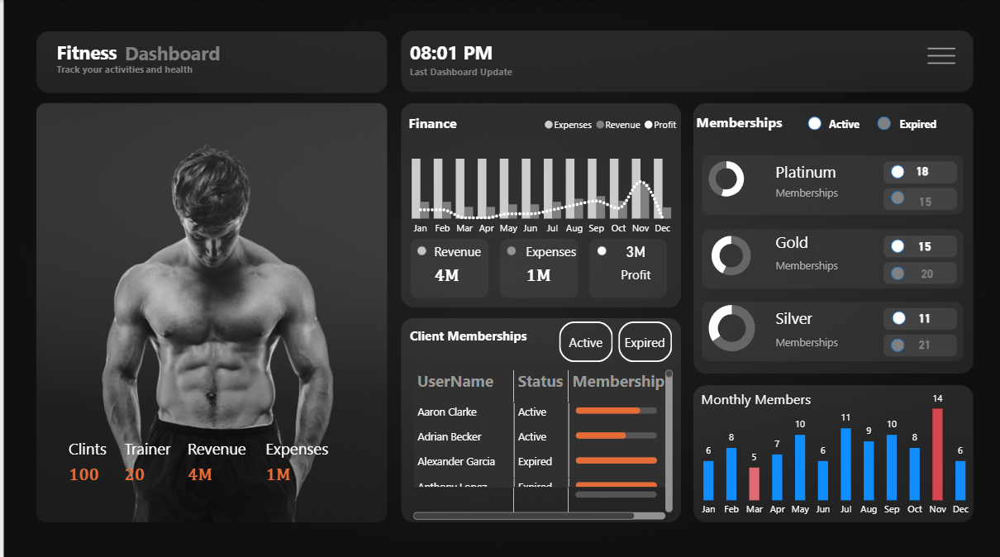

# 🏋️‍♂️ Fitness Dashboard
**Power BI Project by Harshit Tiwari**

This project presents an interactive **Fitness & Gym Management Dashboard** built using **Power BI**. It helps gym owners track **clients, trainers, revenue, expenses, memberships, and monthly performance** with real-time insights.

---

## 🚀 Project Overview
This dashboard enables fitness centers to:
- Monitor **total clients, trainers, revenue & expenses**
- Track **active vs expired memberships**
- Analyze **monthly member trends**
- Understand **financial performance**
- View **member status and membership levels**

---

## 📊 Dashboard KPIs
| Metric | Value |
|--------|--------|
| **Clients** | 100 |
| **Trainers** | 20 |
| **Revenue** | 4M |
| **Expenses** | 1M |
| **Profit** | 3M |

---

## 📈 Visualizations Included
### 🔹 Finance Overview
- Month-wise revenue & expenses  
- Profit tracking  
- Yearly performance trend  

### 🔹 Membership Distribution
- Platinum: Active (18), Expired (15)  
- Gold: Active (15), Expired (20)  
- Silver: Active (11), Expired (21)

### 🔹 Client Membership Table
Shows username, membership status, and membership progress.

### 🔹 Monthly Members Chart
Bar chart showing monthly new memberships (Jan–Dec)

---

## 🧾 Dataset Includes
- Client Name  
- Trainer Details  
- Membership Type  
- Membership Status  
- Revenue  
- Expenses  
- Monthly Member Count  
- Transaction Details  

---

## 🛠️ Tools Used
- **Power BI Desktop**  
- **Power Query**  
- **DAX**  
- **Excel/CSV Dataset**

---

## 📷 Dashboard Preview

---

## 📥 How to Use
1. Download the `.pbix` file  
2. Open it in **Power BI Desktop**  
3. Explore visuals & filters  

---

## 👤 Author
**Harshit Tiwari**  
LinkedIn: www.linkedin.com/in/harshit-tiwari-aa92a3373
Email: ht725608@gmail.com
